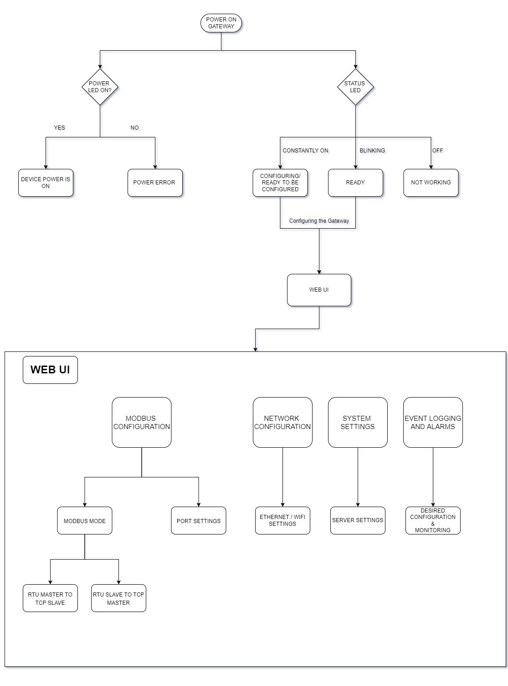
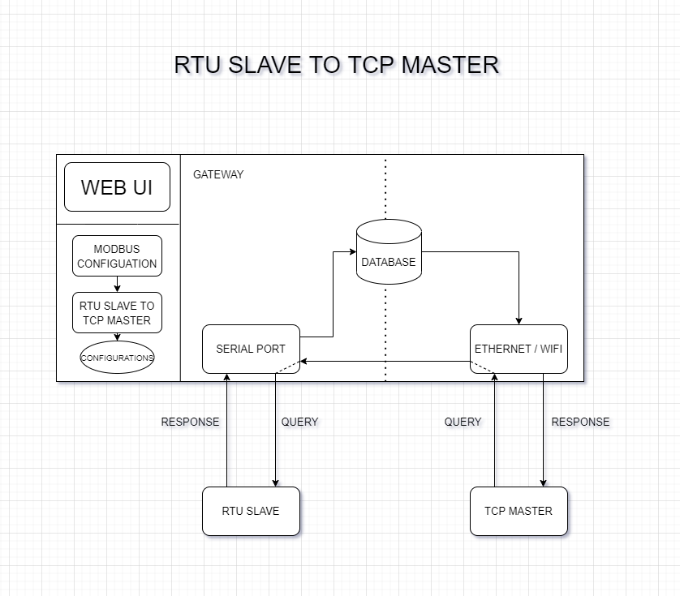
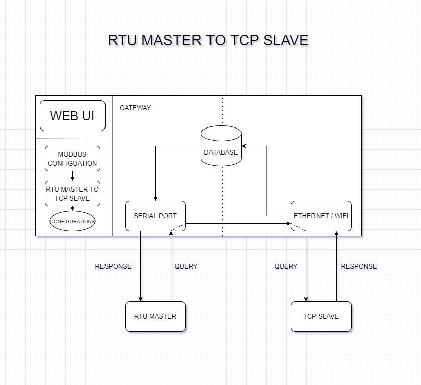
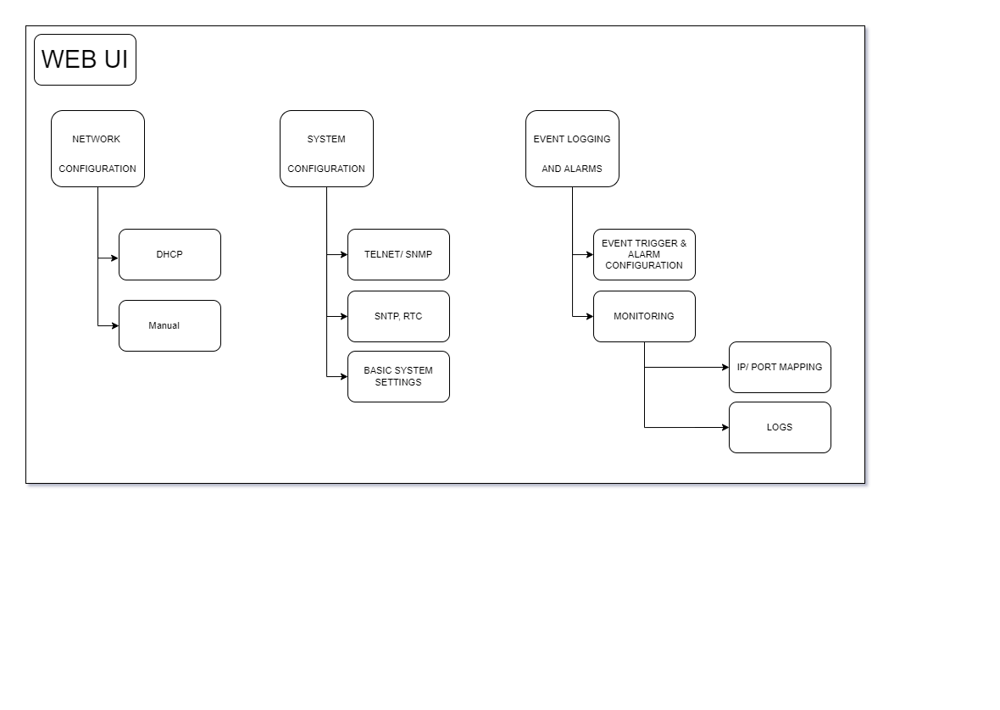

# IIOT Gateway Modbus RTU to TCP

Modbus Gateway is an IIOT solution which uses MODBUS RTU and TCP protocols to monitor and control devices in a multi master-slave configuration remotely on an embedded system.

## The Flow

### GENERAL FLOW 

### RTU SLAVE TO TCP MASTER

### RTU_MASTER_TO_TCP_SLAVE

### WEB UI

